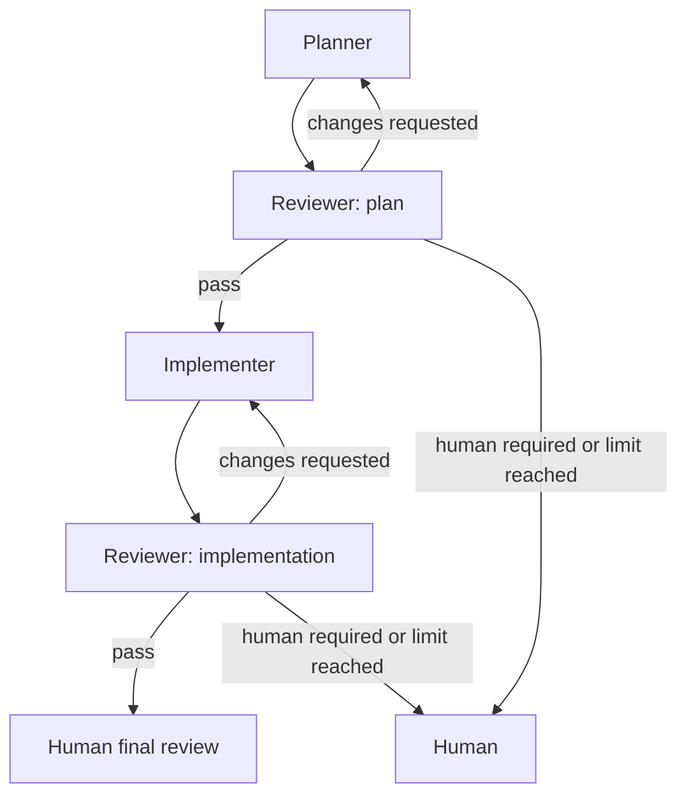

# Agent Spartan Protocol Bridge

The human subscribed to several AI assistants — and was still the messenger.

One planned. Another reviewed the plan. A third could implement, if its usage allowance had not run out. Another reviewed the implementation. Which host took which role was specific to each working repository. When a host's allowance ran out, the human adjusted the bindings.

Then came the work between the work: carrying instructions from one host to another, preserving the reviewer's findings, and making sure the next agent knew what had already been decided.

The assistants could write code. Connecting their work was still a human job.

Agent Spartan Protocol Bridge grew out of that routine. It is an experimental local runtime. You define the host bindings in your repository and adjust them when needed. The Bridge coordinates authorized handoffs and bounded review loops through your already-authenticated clients.

The independent [Agent Spartan Protocol](https://github.com/angelopublio/agent-spartan-protocol) records each task's plan, progress, and review outcomes in a Markdown file under `spartan/tasks/`. That history stays in your repository, so the work remains continuable if you switch tools or stop using the Bridge.

## Naming decision

The recommended names are:

| Surface | Name |
| --- | --- |
| Public project and repository | `agent-spartan-protocol-bridge` |
| Local executable and MCP server | `spartan-bridge` |
| Short skill name | `spbridge` |
| Expected Claude Code invocation | `/spbridge` |

`spbridge` is a short mnemonic for Spartan Protocol Bridge.

## Runtime, interfaces, and skill

The Bridge is a **runtime**, not only a skill. Its core owns policy resolution, state transitions, process supervision, permission enforcement, locks, and operational events. It must be usable without a desktop cockpit and without installing `/spbridge`.

The public surfaces are:

| Surface | Purpose | Required? |
| --- | --- | --- |
| `spartan-bridge` CLI | Host-neutral direct entry point for starting and inspecting runs | Yes |
| `spartan-bridge mcp-stdio` | Local MCP adapter for compatible hosts | Optional |
| `/spbridge` skill | Thin host-specific instructions that call the CLI or MCP adapter | Optional |
| Future daemon | Persistent supervision, multi-project scheduling, and Board control | Later |

The `spartan-bridge` CLI, `spartan-bridge mcp-stdio`, and the `/spbridge` skill ship in this experimental runtime. The daemon is not implemented yet.

The skill does not implement the workflow. It does not parse authoritative policy, choose providers, hold state, or enforce permissions. It only tells the current host how to run one `/spartan` round and then invoke the installed runtime with the explicit task path from the pasted handoff. The runtime itself locates the task and root `AGENTS.md`, resolves policy, validates authority, and controls the run.

The canonical portable package is `agent-skill/`, with one maintained instruction source at
`agent-skill/skills/spbridge/`. Claude Code invokes `/spbridge`. Codex invokes `$spbridge`. Cursor
discovers the package through its supported skill surface. This checkout can also discover
`spbridge` from its own skill trees; adopting repositories still install the portable package into
`~/.agents/skills` and `~/.claude/skills` as documented below. Isolated official-client profiles see a
newly linked user skill after the next wrapped `claude --version` / `codex --version` in that
profile; see [User skills under isolation](docs/AUTHENTICATION-AND-SECURITY.md#user-skills-under-isolation).

## Install on another notebook

Runtime, direct skill discovery, and a host plugin are separate layers. The CLI works without the
skill. The skill or plugin cannot replace the CLI and owns no workflow policy or runtime state.

Prerequisites are Git, Node.js 20 or newer, and any official agent clients already installed and
authenticated through their own supported flows. The Bridge installation never copies or reads
those clients' credentials.

### Install a pinned runtime

Build a tarball from a chosen checkout and install that tarball globally. This keeps consumer
repositories on a fixed build while the development checkout changes. The package is not yet
published to npm, so this README does not claim that `npm install -g spartan-bridge` works from the
registry. Follow [Runtime promotion](docs/RUNTIME-PROMOTION.md) for the build, pack, install,
rollback, and development-build procedures. Verify a repository after adding its Bridge policy
with:

```sh
spartan-bridge doctor --repo /path/to/repository
```

### Install the portable skill directly

From the cloned repository, install both supported discovery links:

```sh
./agent-skill/scripts/manage-install.sh install all
test -f "$HOME/.agents/skills/spbridge/SKILL.md"
test -f "$HOME/.claude/skills/spbridge/SKILL.md"
```

Use `install agents` for the shared Codex/Cursor discovery path or `install claude` for Claude Code
only. The installer touches only the explicitly named `spbridge` symlink and refuses to replace a
real file or directory. It also migrates an existing `spbridge` symlink from the retired
`skills/spbridge` source to `agent-skill/skills/spbridge`; unrelated skill links are unchanged.

### Install the optional Codex plugin

The Codex wrapper is `agent-skill/.codex-plugin/plugin.json`. It points directly at the same
portable `agent-skill/skills/` tree; it is not a second copy and is not a runtime dependency.
Install it from a local clone as a repository marketplace:

```sh
codex plugin marketplace add /absolute/path/to/agent-spartan-protocol-bridge
codex plugin add spbridge@spartan-bridge
codex plugin list
```

A clean notebook may use the Git source instead of an absolute local path:

```sh
codex plugin marketplace add angelopublio/agent-spartan-protocol-bridge
codex plugin add spbridge@spartan-bridge
```

Start a new Codex thread after installation so discovery reloads. Installing the plugin installs the
skill wrapper only; install and verify the runtime separately as shown above.

### Host adapters, updates, and uninstall

Claude, Cursor, Codex, Grok, and future hosts may expose this same portable package through a link,
plugin, or equivalent adapter. Invocation syntax and parent-sandbox approval remain host-specific,
while policy resolution, transitions, permissions, locks, adapter dispatch, and events remain in the
`spartan-bridge` runtime. For Grok install, login, registry, and isolated-profile setup, see
[Use Grok as an official client](docs/AUTHENTICATION-AND-SECURITY.md#use-grok-as-an-official-client).

Update the pinned runtime by repeating the tested tarball promotion in
[Runtime promotion](docs/RUNTIME-PROMOTION.md). Update the portable skill and optional plugin with:

```sh
git pull --ff-only
npm ci
npm run build
./agent-skill/scripts/manage-install.sh install all
codex plugin remove spbridge@spartan-bridge
codex plugin add spbridge@spartan-bridge
```

For a configured Git marketplace, run `codex plugin marketplace upgrade spartan-bridge` before the
remove/add pair. Uninstall only the layers you installed:

```sh
./agent-skill/scripts/manage-install.sh uninstall all
codex plugin remove spbridge@spartan-bridge
codex plugin marketplace remove spartan-bridge
npm uninstall -g spartan-bridge
```

### Running the runtime from a sandboxed host

The shell command that starts `spartan-bridge review` also starts the selected
official-client child. A producer host's sandbox applies to that whole process
tree. The child may need to write its machine-local session state and reach its
provider even though the reviewer workspace and role remain read-only.

Before every review spawn — the first run, each `--after-run` continuation, and
either the `spartan-bridge` binary or `node dist/cli/main.js` fallback — use the
host's command-level approval mechanism if those operations fall outside the
current sandbox. In Codex, approve the shell invocation itself with escalated
sandbox permission. A denial stops before the CLI starts: do not retry
automatically and do not invent or reuse an `--after-run` id.

For uninterrupted producer/reviewer chains, a user may pre-authorize only the
installed `spartan-bridge review` command family in the machine-local settings
of each producer host. This is narrower than unrestricted host access and does
not make three reviews mandatory: `pass` stops after the current review;
`changes_requested` returns findings to the producer and continues only while
the configured cycle limit remains. See
[Pre-authorize Bridge review commands on producer hosts](docs/AUTHENTICATION-AND-SECURITY.md#pre-authorize-bridge-review-commands-on-producer-hosts)
for Codex, Cursor, and Claude Code setup and verification.

This parent-host approval is only launch capability. It does not change Bridge
policy, task write grants, reviewer inputs, or the Cursor adapter's
`--mode plan --sandbox enabled` arguments. Machine-local profile paths and
credential locations never belong in repository configuration or approval
instructions. See [Parent-host sandbox and reviewer permission](docs/AUTHENTICATION-AND-SECURITY.md#parent-host-sandbox-and-reviewer-permission).

Shipped commands:

```text
spartan-bridge --help
spartan-bridge review --repo <path> --task <repo-relative-contained-path> [--after-run <run-id>] [--detach]
spartan-bridge wait --repo <path> --run <run-id> [--timeout-ms <n>]
spartan-bridge resume --repo <path>
spartan-bridge status --repo <path> (--run <run-id> | --task <repo-relative-contained-path>)
spartan-bridge events --repo <path> --run <run-id>
spartan-bridge transition-status --repo <path> --transition <transition-id>
spartan-bridge transition-events --repo <path> --transition <transition-id>
spartan-bridge doctor --repo <path>
spartan-bridge policy --repo <path> --role <planner|implementer>
spartan-bridge mcp-stdio [--repo <path>]
```

There are no `start` or `stop` commands. `review` creates a run from `--task` and does not accept `--run`.

On a terminal, `review` writes the local start time, resolved run, host, model, effort, and client-context alias to stderr, then progress lines made of Bridge-owned class names and counts as the reviewer child advances, then quiet seconds every ten seconds while it waits, then the local end time, terminal state, and duration. When an admitted plan-review continuation ends `failed` with a null verdict, stderr also prints one recovery line naming the parent `--after-run` id and retry cycle; that failed attempt does not consume the chain limit. Stdout stays one JSON status or transition document.

A normal `review` runs in the foreground; closing its invoking environment may interrupt it. `review --detach` starts the authorized chain in a separate session so it can continue after the initiating host closes, and `wait` observes its progress. `resume` explicitly recovers interrupted state; it does not automatically restart a crashed agent. Detachment does not guarantee survival of a crash, shutdown, or reboot. Authorized plan-pass implementation and review loops already run without a daemon. Persistent supervision across crashes or reboots, multi-project scheduling, persistent workers, and a Board control API remain future daemon concerns.

## What the Bridge coordinates

The provider is a binding, not a role. The canonical roles remain:

- `planner`
- `reviewer`, with `review_kind: plan | implementation`
- `implementer`

The Bridge is the orchestrator, not another AI role. It resolves the host, starts a fresh session with the required permissions, enforces loop limits, records events, and validates transitions.

### Client contexts for multiple accounts

A binding may also name a `Client context`. This is an arbitrary, non-secret alias chosen by the user, such as `personal`, `company`, `hobby`, or `client-a`. These names have no built-in meaning and are not limited to a predefined list. For safe parsing, aliases are exact lower-case ASCII strings matching `[a-z0-9][a-z0-9._-]{0,63}`. Matching performs no case folding or Unicode normalization. `default` is reserved for the externally selected fallback context; it is not an account type.

```markdown
| Binding | Host | Client context | Model | Effort |
| --- | --- | --- | --- | --- |
| planner | Codex | personal | gpt-5.6-terra | high |
| reviewer.plan | Grok | personal | grok-4.6 | high |
| implementer | Grok | personal | grok-4.6 | high |
| reviewer.implementation | Grok | personal | grok-4.6 | high |
```

A `reviewer.plan` or `reviewer.implementation` binding must name a host whose
adapter guarantees schema-constrained review output. Codex (`--output-schema`),
Grok (`--json-schema`), and Claude Code (`--json-schema`) all qualify, so any of
the three may hold a reviewer binding. Cursor may not: `cursor-agent` exposes no
structured-output flag, and the Bridge refuses such a dispatch with
`reviewer_output_unconstrained` (D-043, D-046). Cursor remains a valid `planner`
and `implementer` host, as the three-host profile below shows.

The repository records only the alias. A user-local, uncommitted registry maps that alias and host to an externally managed launcher for an official client that the user authenticated beforehand. For example, the alias `personal` may select one local Codex launcher and one local Cursor launcher, while `company` selects another pair. The launchers, official clients, and their credential stores are prepared outside the Bridge. Create that registry at `$HOME/.config/spartan-bridge/client-contexts.yaml` (or under `$XDG_CONFIG_HOME/spartan-bridge/` when that variable is set). See [Configure the client-context registry](docs/AUTHENTICATION-AND-SECURITY.md#configure-the-client-context-registry).

The Bridge does not know which provider account, email address, subscription, token, cookie, or auth file exists behind an alias. Repository files may not contain launcher commands or authentication paths. If no context is declared, the Bridge uses the externally selected `default` client context. An unknown or unavailable context stops for the human.

When one host occupies author and reviewer bindings, as Grok does in this example, each role must still use a fresh execution context. This provides session separation, but it is not cross-host or cross-vendor independence.

### Two-host profile

| Binding | Host | Client context | Model | Effort |
| --- | --- | --- | --- | --- |
| planner | Claude Code | default | claude-opus-5 | high |
| reviewer.plan | Codex | default | gpt-5.6-terra | high |
| implementer | Codex | default | gpt-5.6-terra | high |
| reviewer.implementation | Claude Code | default | claude-opus-5 | high |

### Three-host profile

| Binding | Host | Client context | Model | Effort |
| --- | --- | --- | --- | --- |
| planner | Claude Code | default | claude-opus-5 | high |
| reviewer.plan | Codex | default | gpt-5.6-terra | high |
| implementer | Cursor | default | cursor-grok-4.6-high-fast | none |
| reviewer.implementation | Codex | default | gpt-5.6-terra | high |

This avoids adding provider-shaped roles such as `planner-reviewer` or `implementer-reviewer`. A host may fill more than one role, but author and reviewer must always run in separate execution contexts. Automated reviewer processes are read-only; after validating their structured result, the Bridge may update only the explicitly identified Spartan task artifact when `AGENTS.md` grants that narrow authority.

## Current assisted workflow



In this repository the Bridge may continue a human-started `/spbridge` planner
session after a passing plan review through the mapped implementer and
implementation reviewer when `AGENTS.md` grants that transition and
`spartan-bridge/config.yaml` opts in. Absent or manual config, or an
unavailable producer adapter, still stops at the human implementation gate.
The skill does not spawn that producer. A daemon is not required.

## Required `AGENTS.md` authorization

The Bridge follows the consumer repository's root `AGENTS.md`. Adoption is exactly the pieces the runtime parses, plus one ignore rule, plus one project instruction: the paragraph that sits under the host-binding table. That paragraph is about the Bridge's own invocation, so the Bridge is the only place that can state it correctly for every adopter. Everything else a repository usually wants — role permissions, commit sequencing, an authentication boundary — stays project instruction, not Bridge policy, and is not supplied here as a template.

Copy the following into root `AGENTS.md`. The host-binding table must use these five headers in this order, and it must include a `reviewer.plan` row. A unique `planner` row is optional; when present, it is resolved the same way as `implementer`, so a Host the Bridge does not canonicalize fails the entire policy parse rather than ignoring that row. Host cells must be the display names `Codex`, `Claude Code`, `Cursor`, or `Grok`. A client-context alias is an exact lower-case ASCII string matching `[a-z0-9][a-z0-9._-]{0,63}`, or empty, which resolves to `default`. Model identifiers must match `[A-Za-z0-9][A-Za-z0-9._-]{0,63}`. Effort must be one of `low`, `medium`, `high`, `max`, or `none`. The two automation sentences must match byte for byte. Paste the paragraph under the table as written; the runtime does not parse it.

```markdown
## Agent hosts

| Binding | Host | Client context | Model | Effort |
| --- | --- | --- | --- | --- |
| planner | Claude Code | default | claude-opus-5 | high |
| reviewer.plan | Codex | default | gpt-5.6-terra | high |
| implementer | Cursor | default | cursor-grok-4.6-high-fast | none |
| reviewer.implementation | Codex | default | gpt-5.6-terra | high |

This repository runs the Spartan Bridge. A producer round whose review the Bridge dispatches is
entered through `/spbridge`, and the handoff that precedes it is addressed to that producer rather
than to the reviewer. When the mapped `reviewer.plan` host has no working adapter, or the Bridge is
not installed here, the advisory names the host's own token instead.

## Spartan Bridge automation authority

- A human-started Spartan Bridge run may start the mapped reviewer automatically.
- The Bridge may return findings to the current planner session and repeat up to 3 plan-review cycles.
```

For a two-host repository, change only the binding table:

```markdown
| Binding | Host | Client context | Model | Effort |
| --- | --- | --- | --- | --- |
| planner | Claude Code | default | claude-opus-5 | high |
| reviewer.plan | Codex | default | gpt-5.6-terra | high |
| implementer | Codex | default | gpt-5.6-terra | high |
| reviewer.implementation | Claude Code | default | claude-opus-5 | high |
```

Ignore the runtime directory so local run state is not committed:

```gitignore
.spartan-bridge/
```

A generic statement that a human starts every round does **not** authorize the Bridge to start reviewers. The older sentence below is intentionally incompatible with automatic review:

```text
The human starts every round.
```

Repositories that retain that sentence remain fully manual. The Bridge must fail closed instead of interpreting it loosely. `spartan-bridge doctor --repo <path>` reports whether the repository is configured and whether that policy resolves.

See [Routing and workflows](docs/ROUTING-AND-WORKFLOWS.md) for precedence, the foreground automatic plan-pass chain, and the manual fallback.

## How a host reaches the Bridge

Any compatible host may call the local MCP adapter, while a human or automation may call the CLI directly:

```text
User pastes a handoff into /spbridge
  -> The host runs that round through /spartan
  -> The host calls `spartan-bridge review --repo <workspace> --task <path from the paste>`
     (later corrections in the same chain add `--after-run <run-id>`)
  -> The runtime returns one status document; the skill reports the verdict or reason_code
  -> If verdict is changes_requested and the chain still has budget, /spbridge continues
     the producer round and the next review in the same session (limit bounds this chain)
  -> If the run stops with review_passed, cycle_limit_reached, or chain_refused, the skill
     reports that outcome and does not write the task artifact; for some review_passed
     cases it also prints a recommended next invocation
  -> If a plan-review continuation fails with no verdict, do not pass that failed run as
     `--after-run`; retry the last changes_requested parent. The CLI recovery line states
     that id and cycle; the failed attempt does not consume the limit
```

Alternatively:

```text
User or local automation calls spartan-bridge from a shell
  -> The runtime reads the task and repository AGENTS.md
  -> The same resolver, orchestrator, adapters, and event store run
```

ChatGPT/Codex desktop, Codex CLI, and supported IDE integrations can expose local MCP servers through the OpenAI MCP configuration. Claude Code and other hosts can use their own local MCP registration. See [OpenAI MCP](https://learn.chatgpt.com/docs/extend/mcp).

## Authentication

The Bridge does not authenticate a provider or a user. It does not accept, receive, read, copy, select, store, log, proxy, or persist provider tokens, cookies, authentication files, API keys, Keychain data, browser sessions, or provider account identifiers. It never invokes a login flow. The user signs in through each official local client before starting a run, and the Bridge invokes that already-authenticated client without inspecting its credential store:

- Claude Code authentication remains owned by Claude Code.
- Codex uses the existing local ChatGPT sign-in. The official Codex documentation says `codex login` starts the browser flow for subscription access.
- `CURSOR_API_KEY` and other harness API keys never enter the Bridge or a Bridge-launched process.

There are no Bridge login commands. API keys, auth files, cookies, and Keychain data are never valid Bridge input or repository configuration. `spartan-bridge doctor` checks only non-secret integration facts: repository readability, policy readiness, registry readability and schema validity, launcher identifier resolution, fake-interface capability flags, and Cursor, Codex, Grok, and Claude Code launcher executable and interface availability. Policy readiness covers repository content only. It must never inspect authentication, accounts, credential stores, billing, entitlements, or whether a client is signed in. If an invoked official client reports that external authentication is required, the run stops with a sanitized status.

An available interface reported by `doctor` is not an end-to-end reviewer-session
probe. It does not prove that the current producer sandbox permits the selected
client to create session state or use its provider network. The host-level
approval above is still required when those operations lie outside the current
sandbox.

See [Authentication and security](docs/AUTHENTICATION-AND-SECURITY.md), including [how to configure `client-contexts.yaml`](docs/AUTHENTICATION-AND-SECURITY.md#configure-the-client-context-registry), [how to use Grok as an official client](docs/AUTHENTICATION-AND-SECURITY.md#use-grok-as-an-official-client), [how to isolate official clients on one Mac](docs/AUTHENTICATION-AND-SECURITY.md#isolate-official-clients-on-one-mac), [how to set up those wrappers on a new Mac](docs/AUTHENTICATION-AND-SECURITY.md#set-up-on-a-new-mac), and the official [Codex authentication documentation](https://learn.chatgpt.com/docs/auth). To confirm two IDE windows are using different already-authenticated sessions, follow [Verify isolation](docs/AUTHENTICATION-AND-SECURITY.md#verify-isolation).

## Repository relationships

| Project | Responsibility |
| --- | --- |
| Agent Spartan Protocol | Portable roles, task artifacts, handoff semantics, and defaults |
| Agent Spartan Protocol Bridge | Local execution state, host adapters, loops, locks, and event history |
| Agent Spartan Protocol Board | Read-only-first UI for projects, worktrees, tasks, handoffs, and Bridge status |

The Agent Spartan Protocol Board is an optional sibling UI. It is not public yet, and this repository does not ship or link it. The Board is not required to run the Bridge. The Bridge writes structured run state in the consumer worktree; when published, the Board may read and display it. A future control API may let the Board start, stop, or resume runs, but the Board process should not execute agent subprocesses directly.

## Configuration principles

- `AGENTS.md` is the repository authority for host bindings and automation grants.
- Spartan task artifacts identify the current and next abstract role; they do not choose a provider.
- The user-local registry `$HOME/.config/spartan-bridge/client-contexts.yaml` (or `$XDG_CONFIG_HOME/spartan-bridge/client-contexts.yaml`) maps each `AGENTS.md` client-context alias and host to a launcher identifier. It is not part of the repository. Setup steps are in [Configure the client-context registry](docs/AUTHENTICATION-AND-SECURITY.md#configure-the-client-context-registry). When an isolated profile relocates `HOME`, make that registry visible under the relocated home as described in [Use Grok as an official client](docs/AUTHENTICATION-AND-SECURITY.md#use-grok-as-an-official-client). Machine-local official-client isolation is in [Isolate official clients on one Mac](docs/AUTHENTICATION-AND-SECURITY.md#isolate-official-clients-on-one-mac), including [Set up on a new Mac](docs/AUTHENTICATION-AND-SECURITY.md#set-up-on-a-new-mac), [User skills under isolation](docs/AUTHENTICATION-AND-SECURITY.md#user-skills-under-isolation), and [Verify isolation](docs/AUTHENTICATION-AND-SECURITY.md#verify-isolation).
- Optional in-repo `spartan-bridge/config.yaml` opts a granted `AGENTS.md` transition into automatic dispatch. Today it parses `schema_version`, `transitions.review_plan_pass.{successor, dispatch}` (the automatic plan-pass → implementer opt-in), optional `implementer_timeout_ms`, and optional `producer.{model_binding, scratch_prefixes}`; `model_binding` is `advisory` | `warn` | `strict` (default `advisory`, human-started `/spbridge` producer rounds only), while `scratch_prefixes` declares disposable producer-copy build output under the [documented grammar and overlap rules](docs/ROUTING-AND-WORKFLOWS.md#optional-operational-config). Per-repo `limits`, `timeouts`, `gates`, and storage-path overrides are planned, not yet parsed. It may narrow `AGENTS.md` authority, never broaden it, and never holds credentials.
- Provider credentials never belong in `AGENTS.md`, the user-local registry, or `spartan-bridge/config.yaml`.
- The Bridge pins the resolved policy for the lifetime of a run.
- Ambiguity, contradiction, missing authorization, or an unavailable adapter stops at a human gate.

## Development

Requires Node.js 20 or newer.

```text
npm install
npm run build
npm run typecheck
npm test
```

The CLI entrypoint is `spartan-bridge`. After `npm run build`, run `node dist/cli/main.js --help`.

### Dogfooding the Bridge on this checkout

The default `spartan-bridge` on `PATH` is the pinned consumer runtime, and it
is the runtime every round uses, including rounds on this checkout. A round that
must exercise this checkout's own build runs it by promoting that build; see
[Runtime promotion](docs/RUNTIME-PROMOTION.md).

The stale-build workflow applies only when `spartan-bridge` is missing from
`PATH` and the skill falls back to this checkout's `dist/`, or after reversing
the promotion to restore the checkout's `npm link`. In either case, run
`/spbridge` on this repository only from a built `dist/`. A `git pull` or any
`src/` edit then makes `dist/` stale; `review` and `mcp-stdio` refuse with
`dist/ is older than src/; run npm run build` (exit 1, no run created), and a
detached `wait` loop reports a terminal document with
`"reason_code": "stale_build"` — rebuild and re-invoke `/spbridge` fresh, never
with `--after-run`. A chain using either development-runtime path whose
implementer edits `src/` makes `dist/` stale by construction and cannot rebuild
it, so `wait` follows that chain's terminal document with one stderr line naming
the rebuild as the next round's precondition. The Bridge never runs the build
itself, and unattended continuation across that process boundary is not
offered: one human command stands between such a chain and the next round.

## Project status and next milestone

The experimental runtime provides a host-neutral foreground CLI, an MCP `stdio` adapter, and an optional `/spbridge` skill that sequences one `/spartan` round then one `review` invocation. The CLI and MCP share one structured `review` operation, a fake adapter, real Claude Code, Codex, Grok, and Cursor adapters, schema-constrained task-artifact writes, policy resolution, and append-only local events. Plan reviews, implementation reviews, their independent cycle loops, and the plan-pass auto-chain that runs the mapped implementer and its review unattended have all completed end-to-end during maintainer dogfooding against authenticated official clients, with each validated result written into the named Spartan task artifact.

This is an early-stage project with one primary maintainer. Development uses AI coding agents under maintainer direction (vibe coding). The maintainer uses Claude Code, Codex, Cursor, and Grok, adjusting repository role bindings to available weekly usage allowances. Current validation comes from that use and the repository checks; external adoption has not yet been established. See [Contributing](CONTRIBUTING.md) to report a problem or help improve the project.

[Spartan task records](spartan/README.md) document the project's development decisions and review outcomes.

## Documentation

- [Architecture](docs/ARCHITECTURE.md)
- [Routing and workflows](docs/ROUTING-AND-WORKFLOWS.md)
- [Runtime promotion](docs/RUNTIME-PROMOTION.md)
- [Optional Board integration](docs/BOARD.md)
- [Authentication and security](docs/AUTHENTICATION-AND-SECURITY.md), including [Set up on a new Mac](docs/AUTHENTICATION-AND-SECURITY.md#set-up-on-a-new-mac), [User skills under isolation](docs/AUTHENTICATION-AND-SECURITY.md#user-skills-under-isolation), and [Verify isolation](docs/AUTHENTICATION-AND-SECURITY.md#verify-isolation)
- [Open-source policy](docs/OPEN-SOURCE-POLICY.md)
- [Provenance](docs/PROVENANCE.md)
- [Contributing](CONTRIBUTING.md)
- [Security policy](SECURITY.md)
- [Design decisions](docs/DECISIONS.md)

## License and independence

Original material in this repository is licensed under the [MIT License](LICENSE). That license does not automatically relicense code copied from another repository.

This is an independently developed project. Compatibility references do not imply affiliation with or endorsement by Anthropic, OpenAI, Cursor, or any other referenced project. Product and project names remain the property of their respective owners.
