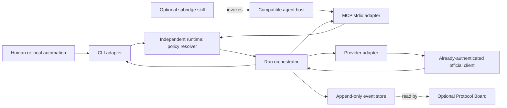

# Architecture

## Boundary

Agent Spartan Protocol Bridge is a standalone external runtime that remains optional to the portable Agent Spartan Protocol. Removing it must leave every task understandable and manually continuable.

The protocol defines what a role means and how a handoff is represented. The Bridge decides how an authorized role is executed locally. A host or model never gains authority merely because it produced text requesting another host.

## Goals

The Bridge is designed to:

- automate bounded producer/reviewer loops without handoff copy/paste;
- delegate authentication entirely to official local clients that the user authenticated before the run;
- keep reviewer execution fresh and read-only;
- keep repository-specific host routing, opaque client-context selection, and automation authority in `AGENTS.md`;
- preserve human gates at producer-host transitions until explicitly authorized;
- keep an append-only operational history that can be displayed by the Board;
- fail closed on ambiguous policy, stale artifacts, credential problems, or unsafe transitions.

The first version is intentionally a foreground runtime. A daemon is not required for a synchronous review call.

## Components



### CLI adapter

The `spartan-bridge` executable is the host-neutral entry point. It must be able to start, review, inspect, and stop foreground runs without a desktop cockpit, a host skill, or an MCP client. It calls the same application core used by every other adapter.

Shipped commands include `review`, `wait`, `resume`, `status`, `events`, `transition-status`, `transition-events`, `doctor`, and `mcp-stdio`. `transition-status` and `transition-events` resolve only a canonical contained transition id, refuse a transition-directory symlink, and open `status.json` / `events.jsonl` as no-follow regular files.

`review --detach` reparents the foreground chain: it spawns the same `review` process `detached`, records it under `.spartan-bridge/invocations/`, prints a JSON ack, and returns immediately. `wait --repo <root> --run <id>` polls that detached chain to its terminal status document within a bounded `--timeout-ms`, printing `{"state":"running"}` and exiting 0 when its own deadline hits first. `resume --repo <root>` is the crash-recovery path (no supervisor exists): it drops a `writer.lock` held by a dead pid and marks an interrupted `awaiting_implementer` successor transition `stopped` / `interrupted`. See [ROUTING-AND-WORKFLOWS.md](ROUTING-AND-WORKFLOWS.md#detaching-the-chain-from-the-callers-shell-d-054) and D-054.

### Optional skill wrapper

`spbridge` is a thin, host-specific invocation aid. It forwards user intent plus an explicit repository, task, or run identifier to a structured Bridge tool. It has no policy parser, routing logic, orchestration state, provider credentials, permission enforcement, or protocol copy. It cannot replace or run without the installed Bridge runtime.

The exact host syntax may differ. The intended Claude Code command is `/spbridge`; other clients may expose a skill or tool with a different sigil while keeping `spbridge` as the identifier.

### MCP adapter

The foreground MCP `stdio` server is one optional adapter for compatible hosts. It exposes the same application core as the CLI. Phase 1B ships newline-delimited JSON-RPC over stdio at MCP revision `2025-06-18`, with methods `initialize`, `notifications/initialized`, `ping`, `tools/list`, and `tools/call`.

It exposes one tool:

```text
review({ task: string })
```

The bound repository root is `process.cwd()` or `--repo` at process start, not a tool argument. Each `tools/call` of `review` creates one plan-review run through the exported `runReview` operation and returns the terminal `status.json` text.

MCP operations for `start`, `status`, `stop`, `resume`, and `events` may be added without moving orchestration into the host or skill. None of those operations are implemented yet.

### Policy and routing resolver

The resolver combines four distinct concerns:

1. the Spartan task identifies the abstract current or next role;
2. root `AGENTS.md` binds roles to hosts, may name an opaque `client_context`, and grants automation authority;
3. optional `spartan-bridge/config.yaml` opts a granted transition into automatic dispatch (today only `review_plan_pass`); planned per-repo limits and operational settings are not yet parsed;
4. the Agent Spartan Protocol supplies defaults when the repository does not override a binding.

Client-context values such as `personal`, `company`, or `hobby` are arbitrary user-defined aliases, not Bridge-owned account profiles. They resolve through a non-secret user-local launcher registry; repository policy never supplies an executable, credential path, or secret. The resolved policy is pinned at run creation. A later edit to `AGENTS.md` does not silently change an active run.

### Run orchestrator

The orchestrator, not an LLM, controls:

- state transitions;
- attempt counters;
- timeouts and cancellation;
- host selection;
- reviewer permissions;
- locks and one-writer rules;
- artifact version and hash checks;
- stop conditions.

An agent may recommend a next role through structured output. The orchestrator validates that recommendation against the pinned transition policy.

### Provider adapters

Each provider adapter follows a small lifecycle:

```text
capabilities -> preflight -> prepare -> start -> collect -> verify -> cleanup
```

`cancel` is the best-effort abort path. Cursor `preflight` spawns exactly `["--help"]` with the pinned environment allowlist, requires exit code 0, and requires the help tokens `--print`, `--output-format`, `--mode`, `--sandbox`, `--workspace`, and `--trust`. It does not start a reviewer session, does not inspect credentials, accounts, authentication files, or billing state, and does not prove that the client can impose a permission mode at runtime. `prepare` materializes any ephemeral reviewer workspace. `verify` re-checks that workspace. `cleanup` always runs when `prepare` ran.

An adapter receives a resolved role, an opaque client-context alias, a pre-registered launcher identifier, immutable artifact references, permission mode, and timeout. Neither the adapter nor any other Bridge component accepts or receives provider tokens, cookies, auth files, API keys, Keychain data, browser sessions, provider account identifiers, or login instructions. The adapter starts the official client and lets that client use its own credential store.

Phase 2A adapters include the fake deterministic adapter, Cursor (`cursor-plan-reviewer-v1`), Codex (`codex-plan-reviewer-v1`), Grok (`grok-plan-reviewer-v1`), and Claude Code (`claude-plan-reviewer-v1`, reviewer-only, `claude -p --output-format stream-json --json-schema`). `CURSOR_API_KEY` stays entirely outside the Bridge boundary and is not a Bridge adapter path.

`AdapterCapabilities.structured_output` is `false` when the launcher CLI cannot force the reviewer's final message to a JSON schema — today only Cursor (D-043). `review.ts` refuses a reviewer dispatch to such an adapter with `reviewer_output_unconstrained` before preflight, and `AGENTS.md` bars a Cursor `reviewer.*` binding (D-046). Codex (`--output-schema`), Grok and Claude Code (`--json-schema`) all report `true`; the one verdict schema lives in `src/adapters/review-schema.ts`.

Stdout-parsing adapters reuse shared extraction (`extractReviewPayload` in `src/adapters/cursor.ts`, imported by Grok) and the core retention path (`composeRetainedPayload` / `writeAdapterPayloadAtomic`) that answers `output_unparsable`. A new adapter must reuse those helpers — or an equivalent that feeds the same core retention — rather than starting from a blank extractor; the failure they defend is a property of model output, not of one host's transport. Cursor `--output-format json|stream-json` remains transport-only: unlike Codex `--output-schema` + `--output-last-message`, the probed Cursor Agent CLI help surface has no schema-constrained final-message path, so missing verdict-shaped JSON stays fail-closed `output_unparsable` (D-043).

Plan-review workspaces remain artifact-only for Cursor, Codex, and Grok plan kind (copies of the task and root `AGENTS.md`). Implementation review uses the shared workspace library where that kind is declared. The repository realpath is never passed for review prompts.

### Operational store

The proposed per-worktree layout is:

```text
.spartan-bridge/
  runs/
    <run-id>/
      policy.json
      status.json
      events.jsonl
      artifacts/
      reviews/
```

`events.jsonl` is the append-only operational truth. `status.json` is a replaceable projection for fast UI reads. Spartan task Markdown remains the human-readable protocol truth.

The directory is local runtime state and should be ignored by Git by default. If a project wants to retain selected review evidence, it should export a redacted artifact explicitly rather than committing the entire run directory.

## Execution modes

### Foreground mode: first release

The user or local automation starts the CLI, or a compatible host starts the MCP adapter. A review call blocks until the reviewer finishes or reaches a timeout. This mode is enough for:

- Claude planner to call Codex plan review;
- Codex implementer to call Claude implementation review;
- Cursor app to call Codex review if its local MCP integration is available.

A normal `review` invocation runs in the foreground and may block through an
authorized implementer and implementation-review successor chain. Its lifetime
depends on the invoking process environment; closing that environment may
interrupt it. `review --detach` starts the chain in a separate session so it can
continue after the initiating host closes. This is process detachment, not a
supervised daemon: it does not guarantee survival of a crash, shutdown, or reboot.
`wait` observes the detached run, and `resume` provides explicit recovery for
interrupted state; neither automatically restarts a crashed agent.

### Daemon mode: later

A daemon becomes useful only when the product must:

- supervise execution independently of host UIs;
- automatically reconcile or recover interrupted work after a crash;
- schedule or coordinate multiple projects;
- manage persistent workers across sessions;
- provide a control API to the Board.

The daemon should reuse the same resolver, orchestrator, adapters, and event contract. It is not required for the initial review function.

## Permissions and isolation

| Role | Required permission | May modify product files? |
| --- | --- | --- |
| `planner` | Read plus planning-artifact write | No |
| `reviewer` | Read-only | No |
| `implementer` | Workspace write | Yes |
| Bridge | Runtime-state write plus narrowly authorized current-task write | No |

Textual prompts are not a security boundary. The launcher must impose the strongest available sandbox or permission mode, and must reject a reviewer adapter that cannot be made read-only. An automated reviewer returns structured output and never writes the task itself. After validation, the Bridge may update only the explicitly identified `spartan/tasks/<task>.md` artifact when pinned repository policy grants that capability. The task write is a separate narrow capability; it does not grant product-file write access.

Phase 2A Cursor plan review ships `--mode plan` and `--sandbox enabled` on the review argv, a `0555` ephemeral workspace with `0444` copies, and a workspace snapshot compared by `verify` that treats any change there as `reviewer_write_detected`. The runtime's own repository-worktree diff is skipped for an isolated adapter — every reviewer adapter is isolated, so it would only ever flag a concurrent external write (D-052) — and runs only for an adapter that reports `isolated_workspace: false`. A real Cursor plan review has since completed in a throwaway fixture worktree with those flags on the argv and did not terminate with `reviewer_write_detected` or `integrity_mismatch`. That is consistent with the flags but does not demonstrate them: the completed dogfood was not an adversarial write attempt, and the one spawn that carried a hostile prompt never started a session, so client-side write prevention by `--mode plan` and `--sandbox enabled` remains unobserved. Snapshot comparison is defense in depth, not an OS-level sandbox. Residual gaps remain: a same-UID process can `chmod` the workspace, restore content and `mtime` to hide a transient write, or write inside skipped `.git`, `node_modules`, or `.spartan-bridge` directories; files above the 1 MiB hash cap are compared by size and `mtimeNs` only. Documentation claims no OS-level sandboxing; none was observed.

Every producer adapter receives a Bridge-owned writable workspace outside the repository as both its `cwd` and client workspace argument. The runtime copies the automatic write scope plus a read-only `node_modules/` support tree. It always treats `node_modules/.cache/` as disposable support scratch; `dist/` is the default build scratch, and a repository may replace that build default with `producer.scratch_prefixes`, including a clean prefix strictly below the support root such as `node_modules/.vite/`. A declared prefix that overlaps the write scope or covers `AGENTS.md` or a support root refuses as `config_invalid`; an overlapping inherited default is dropped so the admitted path remains product. The runtime never copies `.git` or other live-tree paths. A Darwin allow-list sandbox globally denies writes, re-allows only the isolated workspace and the child environment's existing `HOME` and `TMPDIR`, then denies the canonical repository root last. Producer adapters advertise `isolated_producer_workspace: true`; an adapter without it is refused.

After the child exits, the runtime snapshots the copy, removes structural directory metadata deltas and scratch output, validates every admitted change, captures file bytes in memory, and resolves every live destination with Darwin `O_NOFOLLOW_ANY` before any merge write. The guard is released only after capture and destination validation. Merge order is parent directories, files, file deletions, then child-first directory deletions; apply-time errors replay an undo journal. The writer lock, approved-plan hash gate, and post-child live-tree snapshot remain in force. This is runtime policy shared by Cursor, Codex, Grok, and the deterministic fake; adapters only spawn the producer (D-072).

A producer execution stop additionally classifies which orchestration stage failed. `TransitionStatusDocument` and its matching `terminal_stop` `TransitionEventDocument` carry a nullable `producer_diagnostic` with exactly nine closed scalar keys — `stage`, `exit_code`, `timed_out`, `write_scope_code`, `adapter_phase`, `adapter_cause`, `waited_ms`, `snapshot_site`, and `snapshot_cap`. It is constructed for the collapsed producer-failure and timeout arms and for snapshot-capture failures, at the catch/result boundary inside the still-guarded round, and left `null` on unrelated stops, every non-terminal event, and every success. That construction only produces inert returned data; the write-scope guard is released exactly once afterward, and only then is the diagnostic persisted into terminal `status.json` and its `terminal_stop` event, so guard release strictly precedes diagnostic persistence. It reuses closed Bridge vocabulary and never derives a value from stdout, stderr, a payload, or an unrecognized throw's message or class name, so it stays a Bridge-owned classification rather than captured provider output. Old transition records without the field parse with it normalized to `null`; records predating the snapshot keys parse with both keys normalized to `null`.

A Phase 2A review is artifact-only. The reviewer does not inspect product files.

In a manual Spartan round outside the runtime, a human may authorize the reviewer host to update only the current task artifact while keeping product files read-only.

A host may occupy multiple roles, but contexts may not be reused across author and reviewer duties. For example, in a two-host profile Codex plan review and Codex implementation are separate sessions with different permissions.

## Run identity and artifact integrity

Every operation should carry:

- a unique `run_id`;
- protocol and Bridge contract versions;
- role and `review_kind`;
- explicit artifact paths;
- artifact content hashes;
- attempt number;
- pinned policy digest.

The Bridge must never search for a vague “latest handoff.” It must reject a review result if the reviewed artifact changed after the reviewer started.

## Stop conditions

The Bridge stops and returns control to the human when:

- `AGENTS.md` does not explicitly authorize the proposed automatic action;
- producer and reviewer resolve to the same execution context;
- a reviewer cannot be enforced as read-only;
- the artifact hash is stale or an expected task is missing;
- the cycle, time, or failure limit is reached;
- the result is `human_required` or `blocked`;
- routing sources conflict;
- a requested client context is unknown or has no launcher for the resolved host;
- an adapter is unavailable or the official client reports that external authentication is required;
- a transition would change the producer role or host without an explicit grant.

## Implementation provenance

No predecessor implementation has been imported into this repository. Any future incorporation of external material must follow the documented origin, permission, and license requirements in [Open-source policy](OPEN-SOURCE-POLICY.md).
