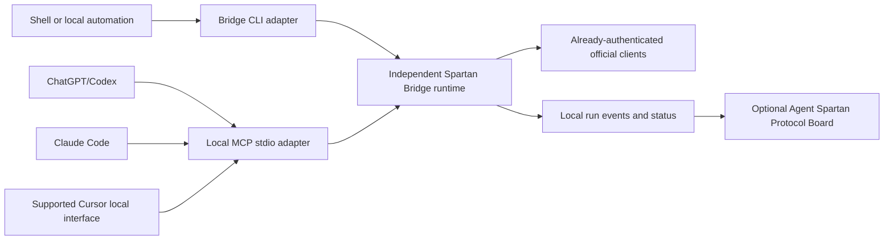

# Optional Board Integration

The Agent Spartan Protocol Board is an optional sibling UI. It is not public yet. It is not required to run the Bridge, and this repository does not ship or link it yet. When published, it may read Bridge run status; it must not become a runtime dependency.

## Independence from the first release

The Spartan Bridge is an independent local runtime. The Agent Spartan Protocol Board is not required to install, start, or use it.

| Component | Responsibility |
| --- | --- |
| Bridge CLI and core runtime | Resolve policy, supervise official local clients, enforce loops and permissions, and record execution state |
| MCP adapter | Expose the same runtime to compatible agent hosts over local `stdio` |
| Optional `/spbridge` skill | Tell a host when and how to call the Bridge; it contains no orchestration state |
| Agent Spartan Protocol Board | Optionally display projects, tasks, handoffs, and Bridge run status |

An independent runtime does not imply a daemon. The runtime executes authorized producer and review chains through the CLI or MCP adapter. `review --detach` lets a chain continue after the initiating host closes; `wait` observes it and `resume` explicitly recovers interrupted state without automatically restarting a crashed agent. Persistent supervision across crashes or reboots, multi-project scheduling, persistent workers, and a Board control API remain future daemon concerns.

## Direct entry points

The core must work through a host-neutral CLI before optional host integrations are considered complete. Shipped commands include:

```text
spartan-bridge review --repo <path> --task <repo-relative-contained-path>
spartan-bridge status --repo <path> --run <run-id>
spartan-bridge mcp-stdio
```

There is no `start` command. `review` creates a run from `--task`; it does not accept `--run` or `--kind`. `status` prints a persisted run when given `--run`, or a task-chain recovery report when given `--task`. See `spartan-bridge --help` for `wait`, `resume`, `events`, `transition-status`, `transition-events`, `doctor`, and `policy`.



The runtime, not the invoking host or skill, reads the explicit Spartan task and root `AGENTS.md`. It resolves the mapped role and optional opaque client-context alias, validates automation authority, applies limits, and starts the pre-registered official-client launcher with the required permission mode.

OpenAI documents local MCP support for ChatGPT desktop, Codex CLI, and IDE integrations. A compatible OpenAI host can start the MCP adapter directly. See [OpenAI MCP](https://learn.chatgpt.com/docs/extend/mcp).

### MCP registration

A project-level entry may have this shape:

```json
{
  "mcpServers": {
    "spartan-bridge": {
      "command": "spartan-bridge",
      "args": ["mcp-stdio"]
    }
  }
}
```

The registration contains no provider credentials or credential environment variables. The host starts the Bridge process, and the Bridge invokes official clients that use their own existing sign-in. No token, cookie, auth file, API key, Keychain item, or browser session is supplied to the Bridge.

## Board integration

The Board remains a thin project and status UI. The Board process must not spawn Claude, Codex, Cursor, or Bridge-owned agent subprocesses.

### First integration: read-only status

The Bridge writes:

```text
.spartan-bridge/runs/<run-id>/events.jsonl
.spartan-bridge/runs/<run-id>/status.json
```

The Board may read the projection and display:

- current phase and role;
- resolved host;
- resolved non-secret client-context alias;
- review kind and attempt;
- elapsed time and last safe event;
- stop reason and required human action;
- artifact and handoff links.

Spartan task Markdown remains the human-facing task truth. `events.jsonl` is the operational execution truth.

### Later integration: daemon control plane

If unattended execution and crash recovery justify a daemon, the Board may call a small local control interface:

```text
start
status
stop
resume
events
```

The preferred transport is a Unix domain socket or another loopback-only mechanism with restrictive local permissions. The Board delegates control to the Bridge daemon; it never becomes the process supervisor.

The Board must show `needs_attention` rather than guess when a projection is stale, the active process is missing, the pinned policy digest differs, a worktree moved, or an official client reports that human action is required.
