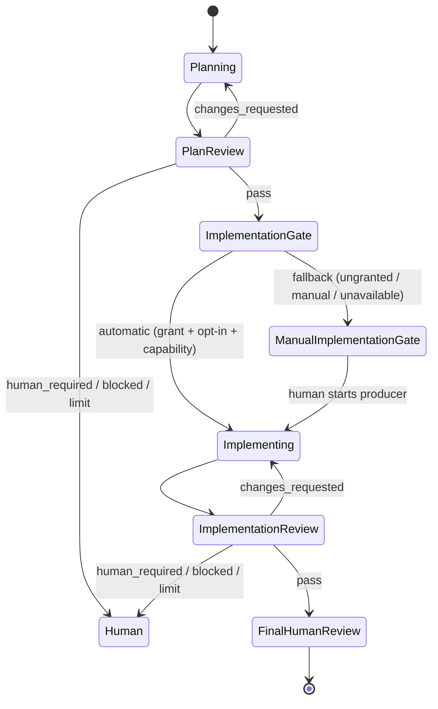

# Routing and Workflows

## Roles and bindings are different concepts

The Bridge uses three canonical AI roles:

| Role | Responsibility |
| --- | --- |
| `planner` | Produce and revise a plan, acceptance criteria, risks, and test strategy |
| `reviewer` | Independently evaluate an artifact and return a structured verdict |
| `implementer` | Change the worktree and run the required checks |

`reviewer` has a required context:

```text
review_kind = plan | implementation
```

The corresponding host selectors are:

```text
planner
reviewer.plan
implementer
reviewer.implementation
```

This is preferable to creating `planner-reviewer` and `implementer-reviewer` roles. Those names suggest a review of a person rather than a review of an artifact, expand the protocol vocabulary, and duplicate the same independent-review contract.

If a future compatibility layer must expose distinct role names, prefer `plan-reviewer` and `implementation-reviewer`. Internally, normalize them to `reviewer` plus `review_kind`.

## Authority model

The consumer repository's root `AGENTS.md` is authoritative for repository-specific host bindings and automation grants. The Bridge must not keep a hidden provider mapping that overrides it.

The sources have separate responsibilities:

| Source | Responsibility |
| --- | --- |
| Spartan task artifact | Current task state, requested abstract role, handoff content |
| Root `AGENTS.md` | Repository host bindings, optional client-context aliases, checks, constraints, and automation grants |
| `spartan-bridge/config.yaml` | Opts a granted `AGENTS.md` transition into automatic dispatch (today only `review_plan_pass`). Optional `implementer_timeout_ms` raises the auto-chain producer wait (raise-only floor `2_700_000` ms). Optional `producer.model_binding` (`advisory` \| `warn` \| `strict`, default `advisory`) governs only human-started `/spbridge` producer rounds. Optional `producer.scratch_prefixes` names disposable build-output paths in the producer copy. Per-repo cycle limits, a full `timeouts:` block, gates, and storage paths remain planned, not parsed. |
| User-local client-context registry | Non-secret mapping from an opaque context alias and host to a pre-registered official-client launcher |
| Agent Spartan Protocol | Portable role contracts and fallback bindings |
| Explicit run request | Selects an already-authorized action; cannot create new authority |

An optional Bridge config may narrow the authority in `AGENTS.md`, but it may not broaden it. Agent-produced handoff text may request a role, but it may not grant permissions, select an arbitrary command, or bypass a human gate.

## Required `AGENTS.md` structure

The minimum assisted three-host policy is:

```markdown
## Agent hosts

| Binding | Host | Client context |
| --- | --- | --- |
| planner | Claude Code | default |
| reviewer.plan | Codex | default |
| implementer | Cursor | default |
| reviewer.implementation | Codex | default |

Bindings not listed here follow the Agent Spartan Protocol defaults.

### What each host accepts as `Model` and `Effort`

The `Model` and `Effort` columns of an `AGENTS.md` binding table are passed
straight to that host's adapter, which turns them into that CLI's own argv. The
shapes differ per host, so a value that is valid for one host is not
necessarily valid for another. Editing a binding table without this in hand is
how a repository ends up declaring a model its CLI rejects.

| Host | Executable | Model becomes | Effort becomes | Reviewer-eligible | Implementer-eligible |
| --- | --- | --- | --- | --- | --- |
| Claude Code | `claude` | `--model <id>` | `--effort <level>`, omitted when `none` | yes, `--json-schema` | no |
| Grok | `grok` | `-m <id>` | `--reasoning-effort <level>`, omitted when `none` | yes, `--json-schema` | yes |
| Codex | `codex` | `-c model="<id>"` | `-c model_reasoning_effort="<level>"`, with `max` sent as `xhigh` | yes, `--output-schema` | yes |
| Cursor | `cursor-agent` | `--model <id>` | encoded into the model string, not a flag | no | yes |

Three consequences worth stating, each learned from a real failure:

- **Cursor encodes effort in the model name; the others do not.** `cursor-agent`
  receives one string, so a Cursor binding names a model such as
  `cursor-grok-4.6-high-fast`, and `composeCursorModelArg` refuses when an
  effort embedded in that name contradicts the `Effort` column. Carrying that
  same name to another host fails: on 2026-09-04 a `Grok` binding was first
  written as `grok-4.6-high-fast`, and `grok` answered
  `Couldn't set model 'grok-4.6-high-fast': Invalid params: "unknown model id"`.
  The correct Grok binding is model `grok-4.6` with effort `high` in its own
  column.
- **The model identifier is not validated against the host.** `MODEL_IDENTIFIER_RE`
  accepts any `^[A-Za-z0-9][A-Za-z0-9._-]{0,63}$` string, and only Cursor
  cross-checks an embedded effort. Every other wrong name reaches the CLI and
  fails there, mid-round.
- **Effort `none` is not "low".** It omits the flag entirely and lets the CLI
  use its own default, except for Cursor, where the model string carries
  whatever it carries.

To confirm a model id before writing it into a binding table, ask the CLI
rather than the Bridge: `grok models`, `codex --help`, `claude --help`. Then
run the composed argv once by hand — for Grok that is
`grok -m <id> --reasoning-effort <level> -p 'responda apenas: ok'`.

Changing a binding table is a human gate. `AGENTS.md` sits outside every
automatic write scope, so no mapped implementer can edit it (D-053), and
`/spbridge` neither reads policy to decide a binding nor writes one. This
section exists so the human, or a session the human explicitly asks, edits that
table correctly the first time.

## Spartan Bridge automation authority

- The human starts the planner producer phase of a chain; later plan-correction cycles continue inside that same human-started planner session. Each authorized automatic implementation or correction producer uses a fresh mapped execution in the same foreground Bridge run.
- A human-started Spartan Bridge run may start the mapped reviewer automatically.
- The reviewer must run in a fresh, read-only session.
- This run grants the Bridge `task_artifact_write` only for persisting validated reviewer findings and transition metadata to the current Spartan task artifact.
- The Bridge may return findings to the current planner session and repeat up to 3 plan-review cycles.
- After a persisted plan-review pass, the Bridge may return implementation findings to a fresh mapped implementer execution and repeat up to 3 implementation-review cycles.
- A producer round that received findings from a Spartan Bridge run may start the next review run automatically within the authorized cycle limit.
- The Bridge must stop on `human_required`, `blocked`, a policy conflict, a cycle limit, an unauthorized chain, or an unvouchable chain reference.
- The Bridge must stop before changing the producer role or producer host, except for the mapped plan-pass implementer transition and its mapped implementation correction executions.
- The Bridge may not start implementation automatically unless this file grants that authority explicitly, `spartan-bridge/config.yaml` opts in, and the mapped producer adapter can enforce workspace-write; otherwise passing from planning to implementation remains a human gate (see [Manual producer transition (fallback)](#manual-producer-transition-fallback)).
```

The Bridge invocation paragraph from the README adoption section sits here, immediately under the table. Do not copy a third source of that text into this document; paste from the README when adopting.

The equivalent two-host binding table is:

```markdown
| Binding | Host | Client context |
| --- | --- | --- |
| planner | Claude Code | default |
| reviewer.plan | Codex | default |
| implementer | Codex | default |
| reviewer.implementation | Claude Code | default |
```

The sentence `The human starts every round.` preserves fully manual execution. It must be replaced or qualified by the explicit automatic-review grant above before the Bridge may start any reviewer.

## Client-context aliases

The optional `Client context` column supports users who keep separate personal, company, hobby, or client accounts in official tools:

```markdown
| Binding | Host | Client context |
| --- | --- | --- |
| planner | Codex | personal |
| reviewer.plan | Codex | personal |
| implementer | Cursor | personal |
| reviewer.implementation | Codex | personal |
```

`personal`, `company`, and `hobby` are examples only. Any exact lower-case ASCII string matching `[a-z0-9][a-z0-9._-]{0,63}` may be used. Resolution performs no case folding or Unicode normalization. `default` is reserved for the externally selected fallback context. The alias is resolved with the host because one logical context may have separate official-client launchers for Codex, Claude Code, Cursor, and Grok.

Repository content may select only the alias. It cannot define the launcher command, environment, auth-file path, account identifier, or secret. A user-local uncommitted registry supplies the non-secret launcher mapping. If the column is omitted, resolution uses `default`. A missing mapping fails closed.

Using the same host for producer and reviewer is allowed only with fresh separate execution contexts and enforced reviewer permissions. It does not provide cross-host or cross-vendor review independence.

## Backward-compatible generic reviewer mapping

Existing repositories may contain a generic mapping such as:

```markdown
| reviewer | Codex |
```

The resolver treats that as a fallback for both review kinds:

```text
reviewer.plan -> reviewer -> protocol default
reviewer.implementation -> reviewer -> protocol default
```

A scoped binding wins over the generic one. This allows existing three-host repositories to keep one Codex reviewer row, while a two-host repository can route plan review to Codex and implementation review to Claude.

## Policy resolution

For every run, the Bridge should:

1. locate the repository root and root `AGENTS.md`;
2. load the explicit Spartan task by ID or path;
3. determine the abstract role and review kind;
4. resolve the most specific host binding and its client-context alias;
5. verify that the requested automatic action is explicitly granted;
6. resolve the alias against the non-secret user-local launcher registry;
7. apply stricter Bridge limits, if present;
8. validate provider availability and permission support without inspecting authentication;
9. persist the resolved policy and its digest before execution.

Missing or contradictory values are not inferred from the currently active model. The Bridge stops with a machine-readable policy error.

## Optional operational config

Operational opt-in for the automatic plan-pass successor may be stored at `spartan-bridge/config.yaml`. This file must not select providers when `AGENTS.md` already defines them, and must never contain credentials. It cannot grant an action `AGENTS.md` denies or omits; it only opts a granted transition in.

The parser is strict: top-level keys are `schema_version` and `transitions`, optionally plus `producer`; exactly the one transition `review_plan_pass`; and two or three entry keys (`successor`, `dispatch`, and optionally `implementer_timeout_ms`). Any other key, a second transition, an anchor/alias/merge, or a missing required key is rejected as `config_invalid`. Schema version stays `1`. The accepted document is:

```yaml
schema_version: 1
transitions:
  review_plan_pass:
    successor: implementer
    dispatch: automatic
```

Optional `implementer_timeout_ms` (positive integer) raises the auto-chain producer child wait. It cannot shorten the wait below the Bridge default (`2_700_000` ms / 45 minutes): configured values below that floor are clamped to the floor. Review child spawns stay at `900_000` ms (15 minutes); producer and review timeouts are independent (D-058).

Optional top-level `producer` is a plain object containing one or both of `model_binding` and `scratch_prefixes`; an empty object or another key is `config_invalid`. `model_binding` is `advisory`, `warn`, or `strict`. Default when the section is absent, the file is absent, or the field is unset: `advisory`. A non-enum value is `config_invalid`. The three modes govern only human-started `/spbridge` producer rounds (the skill compares an already-exposed session identifier to the binding's Model); auto-chain producers stay argv-driven via `--model` and are not in this toggle. `advisory` skips the compare. `warn` prints a one-line notice on mismatch and proceeds. `strict` aborts the `/spbridge` invocation on a knowable mismatch. The Bridge still does not observe or verify the model a producer round actually used (`ProducerIdentity` stays `{ role, host }`; `model_observed: declared_unobserved` when the adapter reports none). See D-068.

`scratch_prefixes` is a non-empty sequence of relative trailing-slash paths using the automatic-scope path grammar. A declaration replaces the `dist/` build default; `node_modules/.cache/` remains an always-applied support scratch prefix. A clean declaration strictly below a producer support root, such as `node_modules/.vite/`, is also valid; the skipped support-root segment is the sole parser exception, so an equal root, an unrelated skipped root, or another skipped segment below the support root remains `config_invalid`. Declared scratch is discarded from both producer-copy snapshots, the collapsed support digest, and merge classification. A declaration that overlaps the automatic implementation write scope, covers the copied `AGENTS.md`, or covers a producer support root is contradictory and stops before registry or adapter work as `config_invalid`. An inherited `dist/` default that overlaps the write scope is instead dropped, so the admitted path remains product. See D-076.

`dispatch: manual` is also accepted and is equivalent to having no file: the run stops at `awaiting_implementer` for the human. See [Foreground automatic implementation transition](#foreground-automatic-implementation-transition) for the two independent conditions that must both hold.

## State machine



### Review result contract

A reviewer returns one of:

- `pass`
- `changes_requested`
- `human_required`
- `blocked`

Findings should include stable IDs, severity, artifact location, evidence, and a concise required change. A reviewer never applies its own findings.

### What a review's workspace bounds

A Bridge review sees only what its workspace contains. In the Phase 2A Cursor plan review that is copies of the named task artifact and root `AGENTS.md`, and nothing else. What a verdict from it can mean is bounded accordingly: it can judge whether a plan is internally consistent, whether its acceptance criteria contradict its decisions, and whether it says enough to act on. It cannot judge that plan against the source tree, a running system, or any other evidence it was never given.

That bound is a property of the inputs, not of the model that ran the review, so no choice of reviewer removes it and no number of cycles compensates for it. When a question needs evidence outside the reviewer's workspace, the round says so and asks the human to run that check in a host that has it — typically the same repository open in an interactive session. Such an opinion is advisory: it records no verdict and writes no artifact, and the round that receives it records what it changed and why.

Automating the plan loop does not widen that workspace. A chained cycle is bounded exactly as a human-started one is, so reaching outside the chain stays a human move by design rather than a gap to be closed later.

### Plan loop

```text
planner -> reviewer(plan)
  changes_requested -> same planner phase revises -> fresh reviewer(plan)
  pass -> automatic implementer (AGENTS.md grant + config opt-in + producer capability)
       -> or manual implementation gate (fallback, see below)
```

The reviewer starts fresh on every attempt. The producer conversation may remain open so the Bridge can return findings directly. A human-started `/spbridge` session invokes `review` once for cycle 1, then continues with `--after-run <run-id>` only while the status document says `review_changes_requested`, `review_chain.cycle` is not null, and that cycle is less than `review_chain.max_cycles`. The Bridge counts review runs in that explicit chain against `max_review_cycles` from `AGENTS.md`; a request that would exceed the limit stops for the human. The limit binds the chain, not a caller that repeats unchained `review`. A human may always start a fresh unchained run on the same task.

### Implementation loop

```text
implementer -> required checks -> reviewer(implementation)
  changes_requested -> implementer fixes -> required checks -> fresh reviewer
  pass -> final human review
```

The reviewer is read-only even when the same provider acts as implementer in another session.

## Manual producer transition (fallback)

After plan approval, the run enters `awaiting_implementer`. When the two independent conditions in [Foreground automatic implementation transition](#foreground-automatic-implementation-transition) are not both met — no `AGENTS.md` grant, no `spartan-bridge/config.yaml` `dispatch: automatic` opt-in, or an unavailable producer adapter — the handoff is stored by run ID in the worktree and stays there. The human opens the mapped implementer in that worktree and provides the run ID; no handoff text needs to be copied.

For the Cursor app, a project MCP configuration may expose the Bridge, and the automatic transition below applies once both of its conditions hold; otherwise the human still opens the producer phase manually.

## Automatic implementation review

A human-started `/spbridge` implementer round may be followed by automatic
`reviewer.implementation` when `AGENTS.md` carries the implementation-review
grant and the artifact declares the implementer round finished (`task_type:
implementation`, `phase: reviewing`, `current_role: implementer`,
`next_role: reviewer`). The Bridge takes that declaration as the
implementer's assertion that the required checks passed. It does not run
those checks and does not verify them. Recording check outcomes remains the
implementer round's obligation.

The Bridge may start an implementer round automatically only after a persisted
plan-review `pass` when `AGENTS.md` grants that transition, operational config
opts in, and the mapped producer adapter can enforce workspace-write. Passing
from planning to implementation remains a human gate whenever that intersection
is incomplete.

## Foreground automatic implementation transition

Automatic dispatch of the implementer itself requires two independent conditions:

1. `AGENTS.md` explicitly grants the Bridge authority to start the mapped implementer after a passing plan review, including the independent implementation-review cycle ceiling, exclusive writer lock, and approved-plan hash;
2. `spartan-bridge/config.yaml` opts in `review_plan_pass -> implementer` with `dispatch: automatic`, and the mapped producer adapter can enforce workspace-write.

The shipped YAML is:

```yaml
schema_version: 1
transitions:
  review_plan_pass:
    successor: implementer
    dispatch: automatic
```

Absent or `dispatch: manual` config, or an unavailable producer capability, returns the existing plan-review `awaiting_implementer` / `pass` / `review_passed` tuple. A malformed config or automatic request without the grant stops after that plan pass with a separate transition record. Before producer capability selection or spawn, the runtime recomputes the currently applicable canonical plan policy digest and stops as `approved_artifact_stale` when it does not match the approved plan run's pinned digest. It also scans the approved artifact's `## Scope` and `## Decisions` for prose-level backticked path tokens. `AGENTS.md` and `spartan-bridge/config.yaml` are always paths; any other token without `/` is a path only when it is in `KNOWN_TOP_LEVEL_NAMES`, and a slash-bearing token is a path only when its leading segment appears in the repository-root listing. An unreadable root listing preserves the prior report-everything behavior. This accepts the advisory false negative for a proposed path under a new top-level directory; the producer write-scope guard remains the write boundary. When any classified token names a path outside the automatic implementation write scope, the transition records those tokens on `unwritable_plan_targets` as an advisory and still spawns the mapped implementer. The write boundary is the Bridge-owned isolated scope copy, its allow-list Darwin sandbox profile, the live-tree snapshot comparison, and validated transactional merge-back; the plan-target scan is not. The chain is foreground: one `review` invocation may block through implementer and implementation-review cycles. It is not a daemon, crash-recovery, or unattended later-phase dispatcher. For detached execution and explicit recovery, see [Detaching the chain from the caller’s shell (D-054)](#detaching-the-chain-from-the-callers-shell-d-054).

### Detaching the chain from the caller's shell (D-054)

The foreground chain runs 8-15 minutes, longer than some host shell-tool
timeouts. `review --detach` decouples it from the caller: the parent spawns
the same `review` process `detached` with its stdio to
`.spartan-bridge/invocations/<run-id>.detach.log`, writes an
`invocations/<run-id>.json` record (`run_id`, `pid`, `after_run`,
`created_at`), prints a one-line JSON ack (`{"detached":true,"run_id":...,"pid":...}`),
and exits 0. The chain then owns itself; the caller follows it with
`spartan-bridge wait --repo <root> --run <run-id> --timeout-ms <ms>`, which
polls run and successor-transition state and either prints the terminal
status document (exit 0 on pass/awaiting-human-open, 1 otherwise) or, on
its own deadline, `{"state":"running","run_id":...,"phase":...,"phase_since":...}`
and exit 0 so the caller loops again. `phase` names the current chain step
(`requested`, a plan-run state, or a successor `TransitionState` such as
`producer_running`); `phase_since` is the ISO-8601 `updated_at` (or invocation
`created_at` during admission) of the record that supplied `phase`. `--after-run`
continuations detach the same way.

Pre-dispatch refusals (`task_invalid`, `task_artifact_write_rejected` /
`composition_failed`) carry a nullable `pre_dispatch_diagnostic` on the status
document and one matching stderr line when present; `reason_code` is unchanged.
Launcher failures carry `adapter_failure.output_excerpt` (and
`output_excerpt_bytes`) beside the existing stderr log fields; `doctor` prints
the excerpt and a signature hint when preflight fails.

`spartan-bridge resume --repo <root>` is the crash-recovery path (there is
no supervisor). It is finalise-only and never long-running: it never
dispatches a fresh `runReview` (that spawn is the 8-15 minute adapter
call). It removes a `writer.lock` whose recorded `pid` is dead.
For each dead-`pid` invocation whose run sits at `awaiting_implementer`
with a non-terminal successor transition, `resume` reads the last transition
event and either finalises, instructs, or stops:

- **`producer_finished` / `path_validated`:** re-acquire the writer lock and
  finalise from a terminal linked review run when one exists (the crash
  happened after `runReview` returned but before `terminal_stop`; no
  double-dispatch). When no terminal linked run exists — a checkpoint that
  would require dispatching a fresh implementation review — leave the
  transition unchanged and print `run /spbridge on this task to dispatch
  the implementation review`.
- **`implementation_review_dispatched` / `implementation_review_result`:**
  finalise only — emit any missing review events, then write the terminal
  transition record and release the lock. No producer round and no adapter
  spawn.
- **`producer_started` / `correction_dispatched` / `authorization` /
  `lock_acquired`:** persist `stopped` / `interrupted` as before; never
  respawn a producer.

`resume` refuses without mutating the transition when the invocation pid is
still alive or a linked implementation-review run is non-terminal.

### Terminal close-out after a passing auto-chain (task 0058)

When `continueAfterPlanReview` reaches `terminal_stop` / `completed` after a
passing implementation review, the runtime performs one further authorized
`task_artifact_write` on the same grant: it rewrites `## Next Action` to a
fixed completion notice naming the implementation-review `run_id`, retracts
`## Next Handoff` when an envelope is still outstanding, and sets
`status: active`, `phase: complete`, and `current_role: human-operator` through
`TERMINAL_CLOSE_FRONTMATTER_KEYS` only on that path. Ordinary plan- or
implementation-review writes still touch only `TASK_WRITE_FRONTMATTER_KEYS`.
The commit remains the human's next action.

`spartan-bridge status --repo <root> --task <path>` is a post-hoc recovery
report for a session that already stopped: it prints the latest completed
transition for that task, the linked implementation-review verdict, and
`git diff --stat` over the automatic-implementation write scope. Existing
`status --run` behaviour is unchanged.

## Invariants

- Provider identity never determines role.
- Review always runs in a fresh, read-only context.
- One worktree has at most one active writer.
- Author and reviewer contexts are never the same.
- Host bindings live in `AGENTS.md`, not in role prompts.
- Credentials never enter Bridge configuration, process arguments, tool requests, runtime state, or logs.
- Runs reference explicit artifacts and hashes, never “the latest handoff.”
- The Bridge controls limits, transitions, and locks.
- Active runs use a pinned policy snapshot.
- Any ungranted action stops for a human.
- A verdict is bounded by what the reviewer's workspace contained; a check needing more is asked of a human.
